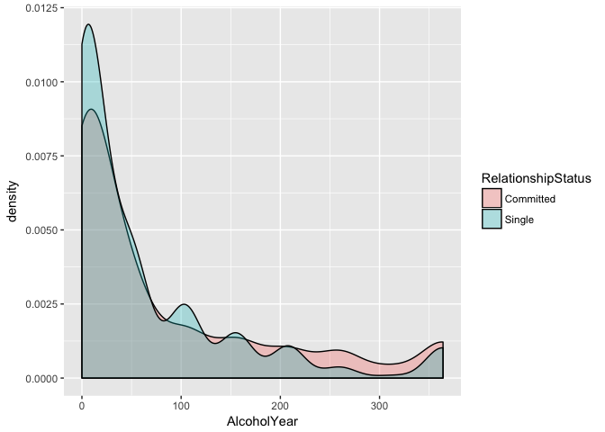

R-Analysis
================
Data Services @ HSL
8/9/2018

AFTERNOON SESSION
=================

### Analysis in R

This session will cover the basics of data analysis in R. We will go over descriptive and inferential statistics including hypothesis testing and assessing assumptions.

This lesson assumes a basic familiarity with R, data frames, and manipulating data with tidyr, dplyr and the pipe `%>%`, and ggplot2.

In this session, we will use the following packages: - tidyverse - or readr, dplyr, & ggplot2

``` r
library(tidyverse)
```

    ## ── Attaching packages ─────────────────────────────────────────── tidyverse 1.2.1 ──

    ## ✔ ggplot2 2.2.1     ✔ purrr   0.2.5
    ## ✔ tibble  1.4.2     ✔ dplyr   0.7.6
    ## ✔ tidyr   0.8.1     ✔ stringr 1.3.1
    ## ✔ readr   1.1.1     ✔ forcats 0.3.0

    ## Warning: package 'dplyr' was built under R version 3.5.1

    ## ── Conflicts ────────────────────────────────────────────── tidyverse_conflicts() ──
    ## ✖ dplyr::filter() masks stats::filter()
    ## ✖ dplyr::lag()    masks stats::lag()

### Download data and skeleton script from GitHub into project

Go to GitHub [repo](https://github.com/mariekekjones/BIMS-bootcamp) to get these materials

### NHANES data

The data we're going to work with comes from the National Health and Nutrition Examination Survey (NHANES) program at the CDC. You can read a lot more about NHANES on the [CDC's website](http://www.cdc.gov/nchs/nhanes/) or [Wikipedia](https://en.wikipedia.org/wiki/National_Health_and_Nutrition_Examination_Survey).

NHANES is a research program designed to assess the health and nutritional status of adults and children in the United States. The survey is one of the only to combine both survey questions and physical examinations. It began in the 1960s and since 1999 examines a nationally representative sample of about 5,000 people each year. The NHANES interview includes demographic, socioeconomic, dietary, and health-related questions. The physical exam includes medical, dental, and physiological measurements, as well as several standard laboratory tests. NHANES is used to determine the prevalence of major diseases and risk factors for those diseases. NHANES data are also the basis for national standards for measurements like height, weight, and blood pressure. Data from this survey is used in epidemiology studies and health sciences research, which help develop public health policy, direct and design health programs and services, and expand the health knowledge for the Nation.

We are using a small slice of this data. We're only using a handful of variables from the 2011-2012 survey years on about 5,000 individuals. The CDC uses a [sampling strategy](http://www.cdc.gov/nchs/data/series/sr_02/sr02_162.pdf) to purposefully oversample certain subpopulations like racial minorities. Naive analysis of the original NHANES data can lead to mistaken conclusions because the percentages of people from each racial group in the data are different from general population. The 5,000 individuals here are resampled from the larger NHANES study population to undo these oversampling effects, so you can treat this as if it were a simple random sample from the American population.

Let's read in the data to an object called `nh` and take a look with `View`. Remember, we need to load both the dplyr and readr packages (or tidyverse) for efficiently reading in and displaying this data.

``` r
# Read in downloaded data using readr package
nh <- read_csv(file="nhanes.csv")
```

    ## Parsed with column specification:
    ## cols(
    ##   .default = col_integer(),
    ##   Gender = col_character(),
    ##   Race = col_character(),
    ##   Education = col_character(),
    ##   MaritalStatus = col_character(),
    ##   RelationshipStatus = col_character(),
    ##   Insured = col_character(),
    ##   Poverty = col_double(),
    ##   HomeOwn = col_character(),
    ##   Work = col_character(),
    ##   Weight = col_double(),
    ##   Height = col_double(),
    ##   BMI = col_double(),
    ##   Testosterone = col_double(),
    ##   HDLChol = col_double(),
    ##   TotChol = col_double(),
    ##   Diabetes = col_character(),
    ##   PhysActive = col_character(),
    ##   SmokingStatus = col_character()
    ## )

    ## See spec(...) for full column specifications.

``` r
# Show the first few lines of the data and the dimensions
nh
```

    ## # A tibble: 5,000 x 32
    ##       id Gender   Age Race    Education    MaritalStatus RelationshipStat…
    ##    <int> <chr>  <int> <chr>   <chr>        <chr>         <chr>            
    ##  1 62163 male      14 Asian   <NA>         <NA>          <NA>             
    ##  2 62172 female    43 Black   High School  NeverMarried  Single           
    ##  3 62174 male      80 White   College Grad Married       Committed        
    ##  4 62174 male      80 White   College Grad Married       Committed        
    ##  5 62175 male       5 White   <NA>         <NA>          <NA>             
    ##  6 62176 female    34 White   College Grad Married       Committed        
    ##  7 62178 male      80 White   High School  Widowed       Single           
    ##  8 62180 male      35 White   College Grad Married       Committed        
    ##  9 62186 female    17 Black   <NA>         <NA>          <NA>             
    ## 10 62190 female    15 Mexican <NA>         <NA>          <NA>             
    ## # ... with 4,990 more rows, and 25 more variables: Insured <chr>,
    ## #   Income <int>, Poverty <dbl>, HomeRooms <int>, HomeOwn <chr>,
    ## #   Work <chr>, Weight <dbl>, Height <dbl>, BMI <dbl>, Pulse <int>,
    ## #   BPSys <int>, BPDia <int>, Testosterone <dbl>, HDLChol <dbl>,
    ## #   TotChol <dbl>, Diabetes <chr>, DiabetesAge <int>, nPregnancies <int>,
    ## #   nBabies <int>, SleepHrsNight <int>, PhysActive <chr>,
    ## #   PhysActiveDays <int>, AlcoholDay <int>, AlcoholYear <int>,
    ## #   SmokingStatus <chr>

``` r
# Optionally bring up data in a viewer window.
# View(nh)
```

This particular excerpt has 5000 observations of 32 variables. We know from our lesson this morning that this dataset contains both children and adults. For us to do analyses with these data, let's focus on adults only.

``` r
# Create adults only dataset
nha <- nh %>%
  filter(Age >= 18)
nha
```

    ## # A tibble: 3,707 x 32
    ##       id Gender   Age Race  Education    MaritalStatus RelationshipStatus
    ##    <int> <chr>  <int> <chr> <chr>        <chr>         <chr>             
    ##  1 62172 female    43 Black High School  NeverMarried  Single            
    ##  2 62174 male      80 White College Grad Married       Committed         
    ##  3 62174 male      80 White College Grad Married       Committed         
    ##  4 62176 female    34 White College Grad Married       Committed         
    ##  5 62178 male      80 White High School  Widowed       Single            
    ##  6 62180 male      35 White College Grad Married       Committed         
    ##  7 62199 male      57 White College Grad LivePartner   Committed         
    ##  8 62199 male      57 White College Grad LivePartner   Committed         
    ##  9 62199 male      57 White College Grad LivePartner   Committed         
    ## 10 62199 male      57 White College Grad LivePartner   Committed         
    ## # ... with 3,697 more rows, and 25 more variables: Insured <chr>,
    ## #   Income <int>, Poverty <dbl>, HomeRooms <int>, HomeOwn <chr>,
    ## #   Work <chr>, Weight <dbl>, Height <dbl>, BMI <dbl>, Pulse <int>,
    ## #   BPSys <int>, BPDia <int>, Testosterone <dbl>, HDLChol <dbl>,
    ## #   TotChol <dbl>, Diabetes <chr>, DiabetesAge <int>, nPregnancies <int>,
    ## #   nBabies <int>, SleepHrsNight <int>, PhysActive <chr>,
    ## #   PhysActiveDays <int>, AlcoholDay <int>, AlcoholYear <int>,
    ## #   SmokingStatus <chr>

So that we don't get confused between the original nh and the nh adults dataset, let's remove the original

``` r
rm(nh)
```

A note on characters versus factors: One thing that you immediately notice is that all the categorical variables are read in as *character* data types. This data type is used for storing strings of text, for example, IDs, names, descriptive text, etc. There's another related data type called ***factors***.

Factor variables are used to represent categorical variables with two or more *levels*, e.g., "male" or "female" for Gender, or "Single" versus "Committed" for RelationshipStatus. For the most part, statistical analysis treats these two data types the same. It's often easier to leave categorical variables as characters. However, in some cases you may get a warning message alerting you that a character variable was converted into a factor variable during analysis. Generally, these warnings are nothing to worry about. You can, if you like, convert individual variables to factor variables, or simply use dplyr's `mutate_if` to convert all character vectors to factor variables:

``` r
# investigate Race (categorical variable)
class(nha$Race)
```

    ## [1] "character"

``` r
levels(nha$Race)
```

    ## NULL

``` r
#create factor variables
nha <- nha %>%
  mutate_if(is.character, as.factor)

class(nha$Race)
```

    ## [1] "factor"

``` r
levels(nha$Race)
```

    ## [1] "Asian"    "Black"    "Hispanic" "Mexican"  "Other"    "White"

### Descriptive Statistics

Descriptive statistics are used to describe the basic features of the data. They provide simple summaries about the sample and the measures.

You could do the below operations using dplyr, but remember, this returns a single-row, single-column tibble, *not* a single scalar value like the above. This is only really useful in the context of grouping and summarizing, so here we will mostly use base R functions.

``` r
# measures of the center
mean(nha$BMI)
```

    ## [1] NA

``` r
mean(nha$BMI, na.rm = TRUE)
```

    ## [1] 28.54567

``` r
median(nha$BMI, na.rm = TRUE) # right skewed
```

    ## [1] 27.6

``` r
# histogram to see distribution
nha %>%
  ggplot(aes(BMI)) + geom_histogram()
```

    ## `stat_bin()` using `bins = 30`. Pick better value with `binwidth`.

    ## Warning: Removed 31 rows containing non-finite values (stat_bin).


``` r
#measures of spread
sd(nha$BMI, na.rm = TRUE)
```

    ## [1] 6.55498

``` r
quantile(nha$BMI, na.rm = TRUE)
```

    ##   0%  25%  50%  75% 100% 
    ## 15.7 23.8 27.6 31.9 80.6

``` r
quantile(nha$BMI, probs = c(.25, .75), na.rm = TRUE)
```

    ##  25%  75% 
    ## 23.8 31.9

``` r
range(nha$BMI, na.rm = TRUE)
```

    ## [1] 15.7 80.6

If you run `summary()` on a data frame, you get some very basic summary statistics on each variable in the data.

``` r
# summary
summary(nha)
```

    ##        id           Gender          Age              Race     
    ##  Min.   :62172   female:1856   Min.   :18.00   Asian   : 215  
    ##  1st Qu.:64526   male  :1851   1st Qu.:31.00   Black   : 417  
    ##  Median :67056                 Median :46.00   Hispanic: 240  
    ##  Mean   :67039                 Mean   :46.52   Mexican : 288  
    ##  3rd Qu.:69534                 3rd Qu.:59.00   Other   :  98  
    ##  Max.   :71915                 Max.   :80.00   White   :2449  
    ##                                                               
    ##           Education         MaritalStatus  RelationshipStatus Insured    
    ##  8th Grade     : 212   Divorced    : 352   Committed:2190     No  : 708  
    ##  9 - 11th Grade: 405   LivePartner : 294   Single   :1395     Yes :2997  
    ##  College Grad  :1128   Married     :1896   NA's     : 122     NA's:   2  
    ##  High School   : 679   NeverMarried: 737                                 
    ##  Some College  :1160   Separated   :  84                                 
    ##  NA's          : 123   Widowed     : 222                                 
    ##                        NA's        : 122                                 
    ##      Income          Poverty        HomeRooms       HomeOwn    
    ##  Min.   :  2500   Min.   :0.000   Min.   : 1.000   Other:  96  
    ##  1st Qu.: 30000   1st Qu.:1.300   1st Qu.: 4.000   Own  :2335  
    ##  Median : 50000   Median :2.780   Median : 6.000   Rent :1258  
    ##  Mean   : 57633   Mean   :2.887   Mean   : 6.071   NA's :  18  
    ##  3rd Qu.:100000   3rd Qu.:4.960   3rd Qu.: 8.000               
    ##  Max.   :100000   Max.   :5.000   Max.   :13.000               
    ##  NA's   :301      NA's   :252     NA's   :18                   
    ##          Work          Weight           Height           BMI       
    ##  Looking   : 159   Min.   : 38.60   Min.   :134.5   Min.   :15.70  
    ##  NotWorking:1317   1st Qu.: 66.40   1st Qu.:161.4   1st Qu.:23.80  
    ##  Working   :2230   Median : 79.30   Median :168.8   Median :27.60  
    ##  NA's      :   1   Mean   : 81.63   Mean   :168.9   Mean   :28.55  
    ##                    3rd Qu.: 93.00   3rd Qu.:176.1   3rd Qu.:31.90  
    ##                    Max.   :198.70   Max.   :200.4   Max.   :80.60  
    ##                    NA's   :27       NA's   :26      NA's   :31     
    ##      Pulse            BPSys           BPDia         Testosterone    
    ##  Min.   : 40.00   Min.   : 81.0   Min.   :  0.00   Min.   :   0.25  
    ##  1st Qu.: 64.00   1st Qu.:110.0   1st Qu.: 64.50   1st Qu.:  20.00  
    ##  Median : 72.00   Median :119.0   Median : 71.00   Median :  92.37  
    ##  Mean   : 72.62   Mean   :121.5   Mean   : 71.03   Mean   : 218.13  
    ##  3rd Qu.: 80.00   3rd Qu.:130.0   3rd Qu.: 78.00   3rd Qu.: 387.27  
    ##  Max.   :136.00   Max.   :221.0   Max.   :116.00   Max.   :1795.60  
    ##  NA's   :123      NA's   :124     NA's   :124      NA's   :269      
    ##     HDLChol         TotChol       Diabetes    DiabetesAge   
    ##  Min.   :0.410   Min.   : 1.530   No :3345   Min.   : 3.00  
    ##  1st Qu.:1.090   1st Qu.: 4.240   Yes: 362   1st Qu.:40.00  
    ##  Median :1.290   Median : 4.910              Median :50.00  
    ##  Mean   :1.369   Mean   : 4.999              Mean   :48.86  
    ##  3rd Qu.:1.580   3rd Qu.: 5.640              3rd Qu.:57.50  
    ##  Max.   :4.030   Max.   :12.280              Max.   :80.00  
    ##  NA's   :207     NA's   :207                 NA's   :3408   
    ##   nPregnancies       nBabies       SleepHrsNight    PhysActive
    ##  Min.   : 1.000   Min.   : 0.000   Min.   : 2.000   No :1692  
    ##  1st Qu.: 2.000   1st Qu.: 2.000   1st Qu.: 6.000   Yes:2015  
    ##  Median : 3.000   Median : 2.000   Median : 7.000             
    ##  Mean   : 2.924   Mean   : 2.375   Mean   : 6.886             
    ##  3rd Qu.: 4.000   3rd Qu.: 3.000   3rd Qu.: 8.000             
    ##  Max.   :13.000   Max.   :11.000   Max.   :12.000             
    ##  NA's   :2442     NA's   :2539     NA's   :9                  
    ##  PhysActiveDays    AlcoholDay      AlcoholYear     SmokingStatus 
    ##  Min.   :1.000   Min.   : 1.000   Min.   :  0.00   Current: 698  
    ##  1st Qu.:2.000   1st Qu.: 1.000   1st Qu.:  3.00   Former : 862  
    ##  Median :4.000   Median : 2.000   Median : 24.00   Never  :2027  
    ##  Mean   :3.817   Mean   : 2.925   Mean   : 74.86   NA's   : 120  
    ##  3rd Qu.:5.000   3rd Qu.: 3.000   3rd Qu.:104.00                 
    ##  Max.   :7.000   Max.   :82.000   Max.   :364.00                 
    ##  NA's   :1951    NA's   :1210     NA's   :723

The `summary()` function is different from **dplyr**'s `summarize()`. It works differently depending on which kind of object you pass to it.

For categorical variables, calculating a mean or standard deviation does not make sense. Instead, we can tabulate the frequencies of each level of the categorical variable.

``` r
#descriptive stats for discrete variables
table(nha$Race)
```

    ## 
    ##    Asian    Black Hispanic  Mexican    Other    White 
    ##      215      417      240      288       98     2449

``` r
#cross tabulation
table(nha$Gender, nha$Race) 
```

    ##         
    ##          Asian Black Hispanic Mexican Other White
    ##   female   115   221      123     128    44  1225
    ##   male     100   196      117     160    54  1224

### \*\* EXERCISE 1 ** ** YOUR TURN \*\*

A. Calculate the median Income in the NHA dataset

B. Find the variance of Weight

C. What is the range of Pulse?

D. Create a density plot showing BMI colored and faceted by Education level

``` r
#A.
median(nha$Income, na.rm = TRUE)
```

    ## [1] 50000

``` r
#B.
var(nha$Weight, na.rm = TRUE)
```

    ## [1] 433.2193

``` r
#C.
range(nha$Pulse, na.rm = TRUE)
```

    ## [1]  40 136

``` r
#D
nha %>%
  ggplot(aes(BMI)) + geom_density(aes(color = Education)) +
  facet_wrap(~ Education)
```

    ## Warning: Removed 31 rows containing non-finite values (stat_density).


### T-tests

Slides

Let's do a few two-sample t-tests to test for the *difference in means between two groups*. The function for a t-test is `t.test()`. See the help for `?t.test`.

1.  Are there differences in height for males versus females in this dataset?

To assess this question, first we make sure that a t-test is the correct type of analysis. A t-test tests the difference in 2 means - yes that is what we want to do. Next we need to decide what type of t-test we need to perform by thinking through the assumptions. Domain specific knowledge and exploratory data analyses will help here.

Random sampling -- YES

Independent samples -- YES (men and women are different people - unrelated). Would be paired t-test if we were assessing height of husband-wife pairs or brother-sister pairs

Normality -- ?? well, we need to assess this. We'll discuss this in a few minutes.

Equal variance. Also called homoscedasticity of variances. ?? we could think about the populations of men and women and what we know about height and conclude reasonably that the variance is equal for height

Density plots are an excellent way to assess normality and equal variance all in one plot

``` r
# EDA
#create overlapping density plots of height colored by gender
nha %>%
  ggplot(aes(Height)) + geom_density(aes(fill = Gender, alpha = .5))
```

    ## Warning: Removed 26 rows containing non-finite values (stat_density).


Normality can be assessed graphically or via hypothesis tests. There are pros and cons to either approach.

Graphically, we could look at a histogram or density plot (like we did above), a boxplot, or a more specialized plot to assess normality called a QQ plot (quantile-quantile plot or quantile comparison plot or normal probability plot). A qq plot graphs the expected data value given a normal distribution on the X axis against the observed data value on the y axis.

Let's have a look for height:

``` r
#normality is best assessed using qq plots for each sex
nha %>%
  ggplot(aes(sample = Height)) + 
  geom_qq() +
  facet_wrap(~Gender)
```

    ## Warning: Removed 26 rows containing non-finite values (stat_qq).


Certain fields love hypothesis tests of normality and sometimes reviewers will specifically request one. There is a theoretical problem with trying to *prove* a null hypothesis and they are known to reject the null when sample sizes are large. My best advice is to use your brain, subject matter expertise, and graphical assessments as much as possible, but in case you are forced to do a hypothesis test for normality check out shapiro.test()

The least awful seems to be the Shapiro-Wilk (<https://www.ncbi.nlm.nih.gov/pmc/articles/PMC3693611/>) but there are several options (Kolmogorov-Smirnov, Anderson-Darling, Lillefors). We will not spend time to cover those here because the field is moving towards qq plots.

Now that we know what test to run, let's run it

``` r
# equal variance, independent samples t-test
?t.test()
t.test(Height ~ Gender, data = nha, var.equal = TRUE)
```

    ## 
    ##  Two Sample t-test
    ## 
    ## data:  Height by Gender
    ## t = -55.713, df = 3679, p-value < 2.2e-16
    ## alternative hypothesis: true difference in means is not equal to 0
    ## 95 percent confidence interval:
    ##  -14.29236 -13.32062
    ## sample estimates:
    ## mean in group female   mean in group male 
    ##             161.9618             175.7683

``` r
# if we didn't have normality met, run wilcox.test
wilcox.test(Height ~ Gender, data = nha)
```

    ## 
    ##  Wilcoxon rank sum test with continuity correction
    ## 
    ## data:  Height by Gender
    ## W = 323540, p-value < 2.2e-16
    ## alternative hypothesis: true location shift is not equal to 0

### \*\* EXERCISE 2 ** ** YOUR TURN \*\* Still using the adults (`nha`) dataset, use a test of 2 means to assess whether single or married/cohabitating people (using the RelationshipStatus variable) drink more alcohol (AlcoholYear). (Please feel free to ask for help)

A. First, create plot to explore the distribution of the variables and the relationship between these two variables.

B. Next, consider test assumptions to decide what analysis to run.

C. Run the analysis. Is the association between relationship status and alcohol consumption statistically significant? If so, which group drinks more often?

``` r
#A.
nha %>%
  filter(!is.na(RelationshipStatus)) %>%
  ggplot(aes(AlcoholYear)) + 
  geom_density(aes(fill = RelationshipStatus, alpha = .3))
```

    ## Warning: Removed 698 rows containing non-finite values (stat_density).



``` r
#B&C based on plots, do wilcox
wilcox.test(AlcoholYear ~ RelationshipStatus, data = nha)
```

    ## 
    ##  Wilcoxon rank sum test with continuity correction
    ## 
    ## data:  AlcoholYear by RelationshipStatus
    ## W = 1068000, p-value = 0.0001659
    ## alternative hypothesis: true location shift is not equal to 0

``` r
#calculate median and IQR for each group
nha %>%
  group_by(RelationshipStatus) %>%
  summarize(medAlc = median(AlcoholYear, na.rm = TRUE),
            Q1Alc = quantile(AlcoholYear, probs = .25, na.rm = TRUE),
            Q3Alc = quantile(AlcoholYear, probs = .75, na.rm = TRUE))
```

    ## # A tibble: 3 x 4
    ##   RelationshipStatus medAlc Q1Alc Q3Alc
    ##   <fct>               <dbl> <dbl> <dbl>
    ## 1 Committed              24     3   156
    ## 2 Single                 24     3   104
    ## 3 <NA>                   24     4    52

### ANOVA and LM

See slides

> Analysis of variance and linear modeling are complex topics that deserve an entire semester dedicated to theory, design, and interpretation. A very good resource is [*An Introduction to Statistical Learning: with Applications in R*](https://www.amazon.com/Introduction-Statistical-Learning-Applications-Statistics/dp/1461471370/ref=sr_1_1?ie=UTF8&qid=1473087847&sr=8-1&keywords=introduction+statistical+learning&tag=gettgenedone-20) by Gareth James, Daniela Witten, Trevor Hastie and Robert Tibshirani. The [PDF](http://www-bcf.usc.edu/~gareth/ISL/ISLR%20Sixth%20Printing.pdf) of the book and all the R code used throughout are [available **free** on the author's website](http://www-bcf.usc.edu/~gareth/ISL/). What follows is a necessary over-simplification with more focus on implementation, and less on theory and design.

Where t-tests and their nonparametric substitutes are used for assessing the differences in means between two groups, ANOVA is used to assess the significance of differences in means between multiple groups. In fact, a t-test is just a specific case of ANOVA when you only have two groups. And both t-tests and ANOVA are just specific cases of linear regression, where you're trying to fit a model describing how a continuous outcome (e.g., BMI) changes with some predictor variable (e.g., diabetic status, race, age, etc.). The distinction is largely semantic -- with a linear model you're asking, "do levels of a categorical variable affect the response?" where with ANOVA or t-tests you're asking, "does the mean response differ between levels of a categorical variable?"

Let's examine the relationship between BMI and relationship status (`RelationshipStatus` was derived from `MaritalStatus`, coded as *Committed* if MaritalStatus is Married or LivePartner, and *Single* otherwise). Let's first do this with a t-test, and for now, let's assume that the variances between groups *are* equal.

``` r
# t-test with equal variance for BMI explained by relationship status
t.test(BMI ~ RelationshipStatus, data = nha, var.equal = TRUE)
```

    ## 
    ##  Two Sample t-test
    ## 
    ## data:  BMI by RelationshipStatus
    ## t = -1.5319, df = 3552, p-value = 0.1256
    ## alternative hypothesis: true difference in means is not equal to 0
    ## 95 percent confidence interval:
    ##  -0.77817842  0.09552936
    ## sample estimates:
    ## mean in group Committed    mean in group Single 
    ##                28.51343                28.85475

It looks like single people have a very slightly higher BMI than those in a committed relationship, but the magnitude of the difference is trivial, and the difference is not significant. Now, let's do the same test in a linear modeling framework. First, let's create the fitted model and store it in an object called `fit`.

``` r
# Same question run in a linear model framework
fit <- lm(BMI ~ RelationshipStatus, data = nha)
fit
```

    ## 
    ## Call:
    ## lm(formula = BMI ~ RelationshipStatus, data = nha)
    ## 
    ## Coefficients:
    ##              (Intercept)  RelationshipStatusSingle  
    ##                  28.5134                    0.3413

``` r
summary(fit)
```

    ## 
    ## Call:
    ## lm(formula = BMI ~ RelationshipStatus, data = nha)
    ## 
    ## Residuals:
    ##     Min      1Q  Median      3Q     Max 
    ## -12.813  -4.613  -0.955   3.287  52.087 
    ## 
    ## Coefficients:
    ##                          Estimate Std. Error t value Pr(>|t|)    
    ## (Intercept)               28.5134     0.1388 205.440   <2e-16 ***
    ## RelationshipStatusSingle   0.3413     0.2228   1.532    0.126    
    ## ---
    ## Signif. codes:  0 '***' 0.001 '**' 0.01 '*' 0.05 '.' 0.1 ' ' 1
    ## 
    ## Residual standard error: 6.473 on 3552 degrees of freedom
    ##   (153 observations deleted due to missingness)
    ## Multiple R-squared:  0.0006602,  Adjusted R-squared:  0.0003789 
    ## F-statistic: 2.347 on 1 and 3552 DF,  p-value: 0.1256

> ***A note on dummy coding:*** If you have a *k*-level factor, R creates *k* − 1 dummy variables, or indicator variables, by default, using the alphabetically first level as baseline. For example, the levels of RelationshipStatus are "Committed" and "Single". R creates a dummy variable called "RelationshipStatusSingle" that's **0** if you're committed, and **1** if you're Single. The linear model is saying for every unit increase in RelationshipStatusSingle, i.e., going from committed to single, results in a 0.341-unit increase in BMI. You can change the ordering of the factors to change the interpretation of the model (e.g., treating Single as baseline and going from Single to Committed). We'll do this in the next section.

``` r
# same question run as an ANOVA
anova(fit)
```

    ## Analysis of Variance Table
    ## 
    ## Response: BMI
    ##                      Df Sum Sq Mean Sq F value Pr(>F)
    ## RelationshipStatus    1     98  98.320  2.3467 0.1256
    ## Residuals          3552 148819  41.897

Now notice a few things: 1. The p-values from all three tests (t-test, ANOVA, and linear regression) are all identical (p=0.1256). This is because they're all identical: a t-test is a specific case of ANOVA, which is a specific case of linear regression.

1.  The test statistics are all related. The *t* statistic from the t-test is **1.532**, which is the same as the t-statistic from the linear regression. If you square that, you get **2.347**, the *F* statistic from the ANOVA.
2.  The `t.test()` output shows you the means for the two groups, Committed and Single. Just displaying the `fit` object itself or running `summary(fit)` shows you the coefficients for a linear model. Here, the model assumes the "baseline" RelationshipStatus level is *Committed* (first alphabetically), and that the *intercept* in a regression model (e.g., *β*<sub>0</sub> in the model *Y* = *β*<sub>0</sub> + *β*<sub>1</sub>*X*) is the mean of the baseline group (28.51 is the mean BMI for Committed people). Being *Single* results in an increase in BMI of 0.3413. This is the *β*<sub>1</sub> coefficient in the model. You can easily change the ordering of the levels. See the help for `?factor`, and check out the new [**forcats** package](http://forcats.tidyverse.org/), which provides tools **for** manipulating **cat**egorical variables.

### ANOVA with 3 groups

Recap: t-tests are for assessing the differences in means between *two* groups. A t-test is a specific case of ANOVA, which is a specific case of a linear model. Let's run ANOVA, but this time looking for differences in means between more than two groups.

Let's look at the relationship between smoking status (Never, Former, or Current), and BMI.

``` r
# levels of smoking status
levels(nha$SmokingStatus)
```

    ## [1] "Current" "Former"  "Never"

``` r
# linear model for the relationship between smoking status and BMI
fit <- lm(BMI ~ SmokingStatus, data = nha)
anova(fit)
```

    ## Analysis of Variance Table
    ## 
    ## Response: BMI
    ##                 Df Sum Sq Mean Sq F value   Pr(>F)    
    ## SmokingStatus    2   1411  705.50  16.988 4.54e-08 ***
    ## Residuals     3553 147551   41.53                     
    ## ---
    ## Signif. codes:  0 '***' 0.001 '**' 0.01 '*' 0.05 '.' 0.1 ' ' 1

``` r
summary(fit)
```

    ## 
    ## Call:
    ## lm(formula = BMI ~ SmokingStatus, data = nha)
    ## 
    ## Residuals:
    ##     Min      1Q  Median      3Q     Max 
    ## -12.565  -4.556  -1.056   3.315  51.744 
    ## 
    ## Coefficients:
    ##                     Estimate Std. Error t value Pr(>|t|)    
    ## (Intercept)          27.3914     0.2446 111.975  < 2e-16 ***
    ## SmokingStatusFormer   1.7736     0.3293   5.387 7.65e-08 ***
    ## SmokingStatusNever    1.4645     0.2838   5.161 2.60e-07 ***
    ## ---
    ## Signif. codes:  0 '***' 0.001 '**' 0.01 '*' 0.05 '.' 0.1 ' ' 1
    ## 
    ## Residual standard error: 6.444 on 3553 degrees of freedom
    ##   (151 observations deleted due to missingness)
    ## Multiple R-squared:  0.009472,   Adjusted R-squared:  0.008915 
    ## F-statistic: 16.99 on 2 and 3553 DF,  p-value: 4.54e-08

The F-test on the ANOVA table tells us that there *is* a significant difference in means between current, former, and never smokers (p=4.54 × 10<sup>−8</sup>). However, the linear model output might not have been what we wanted. Because the default handling of categorical variables is to treat the alphabetical first level as the baseline, "Current" smokers are treated as baseline, and this mean becomes the intercept, and the coefficients on "Former" and "Never" describe how those groups' means differ from current smokers.

What if we wanted "Never" smokers to be the baseline, followed by Former, then Current? Have a look at `?factor` and `?relevel` to change the factor levels.

``` r
#change reference category to Never
nha$SmokingStatus <- factor(nha$SmokingStatus, levels = c("Never", "Former", "Current"))

#check re-leveling
levels(nha$SmokingStatus)
```

    ## [1] "Never"   "Former"  "Current"

``` r
# re-create the fit and ANOVA summary
fit <- lm(BMI ~ SmokingStatus, data = nha)
anova(fit)
```

    ## Analysis of Variance Table
    ## 
    ## Response: BMI
    ##                 Df Sum Sq Mean Sq F value   Pr(>F)    
    ## SmokingStatus    2   1411  705.50  16.988 4.54e-08 ***
    ## Residuals     3553 147551   41.53                     
    ## ---
    ## Signif. codes:  0 '***' 0.001 '**' 0.01 '*' 0.05 '.' 0.1 ' ' 1

``` r
summary(fit)
```

    ## 
    ## Call:
    ## lm(formula = BMI ~ SmokingStatus, data = nha)
    ## 
    ## Residuals:
    ##     Min      1Q  Median      3Q     Max 
    ## -12.565  -4.556  -1.056   3.315  51.744 
    ## 
    ## Coefficients:
    ##                      Estimate Std. Error t value Pr(>|t|)    
    ## (Intercept)           28.8558     0.1438 200.601  < 2e-16 ***
    ## SmokingStatusFormer    0.3091     0.2632   1.175     0.24    
    ## SmokingStatusCurrent  -1.4645     0.2838  -5.161  2.6e-07 ***
    ## ---
    ## Signif. codes:  0 '***' 0.001 '**' 0.01 '*' 0.05 '.' 0.1 ' ' 1
    ## 
    ## Residual standard error: 6.444 on 3553 degrees of freedom
    ##   (151 observations deleted due to missingness)
    ## Multiple R-squared:  0.009472,   Adjusted R-squared:  0.008915 
    ## F-statistic: 16.99 on 2 and 3553 DF,  p-value: 4.54e-08

Notice that the p-value on the ANOVA/regression didn't change, but the coefficients did. *Never* smokers are now treated as baseline. The intercept coefficient (28.856) is now the mean for *Never* smokers. The `SmokingStatusFormer` coefficient of .309 shows the apparent increase in BMI that former smokers have when compared to never smokers, but that difference is not significant (p=.24). The `SmokingStatusCurrent` coefficient of -1.464 shows that current smokers actually have a lower BMI than never smokers, and that this decrease is highly significant.

Finally, you can do the typical post-hoc ANOVA procedures on the fit object. For example, the `TukeyHSD()` function will run [*Tukey's test*](https://en.wikipedia.org/wiki/Tukey%27s_range_test) (also known as *Tukey's range test*, the *Tukey method*, *Tukey's honest significance test*, *Tukey's HSD test* (honest significant difference), or the *Tukey-Kramer method*). Tukey's test computes all pairwise mean difference calculation, comparing each group to each other group, identifying any difference between two groups that's greater than the standard error, while controlling the type I error for all multiple comparisons. First run `aov()` (**not** `anova()`) on the fitted linear model object, then run `TukeyHSD()` on the resulting analysis of variance fit.

``` r
# check out Tukey's multiple comparisons
TukeyHSD(aov(fit))
```

    ##   Tukey multiple comparisons of means
    ##     95% family-wise confidence level
    ## 
    ## Fit: aov(formula = fit)
    ## 
    ## $SmokingStatus
    ##                      diff        lwr        upr     p adj
    ## Former-Never    0.3091076 -0.3079639  0.9261790 0.4685044
    ## Current-Never  -1.4644502 -2.1298249 -0.7990756 0.0000008
    ## Current-Former -1.7735578 -2.5455631 -1.0015525 0.0000002

``` r
plot(TukeyHSD(aov(fit)))
```


This shows that there isn't much of a difference between former and never smokers, but that both of these differ significantly from current smokers, who have significantly lower BMI.

Finally, let's visualize the differences in means between these groups. The **NA** category, which is omitted from the ANOVA, contains all the observations who have missing or non-recorded Smoking Status.

``` r
# plot results
nha %>%
  ggplot(aes(SmokingStatus, BMI)) + geom_boxplot()
```

    ## Warning: Removed 31 rows containing non-finite values (stat_boxplot).


``` r
# plot results without NA bc ANOVA automatically removed those
nha %>%
  filter(!is.na(SmokingStatus)) %>%
  ggplot(aes(SmokingStatus, BMI)) + geom_boxplot()
```

    ## Warning: Removed 31 rows containing non-finite values (stat_boxplot).


### Linear model with 2 continuous variables

See slides

Linear models are mathematical representations of the process that (*we think*) gave rise to our data. The model seeks to explain the relationship between a variable of interest, our *Y*, *outcome*, *response*, or *dependent* variable, and one or more *X*, *predictor*, or *independent* variables. Previously we talked about t-tests or ANOVA in the context of a simple linear regression model with only a single predictor variable, *X*:

*Y* = *β*<sub>0</sub> + *β*<sub>1</sub>*X*

But you can have multiple predictors in a linear model that are all additive, accounting for the effects of the others:

*Y* = *β*<sub>0</sub> + *β*<sub>1</sub>*X*<sub>1</sub> + *β*<sub>2</sub>*X*<sub>2</sub> + *ϵ*

-   *Y* is the response
-   *X*<sub>1</sub> and *X*<sub>2</sub> are the predictors
-   *β*<sub>0</sub> is the intercept, and *β*<sub>1</sub>, *β*<sub>2</sub> etc are *coefficients* that describe what 1-unit changes in *X*<sub>1</sub> and *X*<sub>2</sub> do to the outcome variable *Y*.
-   *ϵ* is random error. Our model will not perfectly predict *Y*. It will be off by some random amount. We assume this amount is a random draw from a Normal distribution with mean 0 and standard deviation *σ*.

*Building a linear model* means we propose a linear model and then estimate the coefficients and the variance of the error term. Above, this means estimating *β*<sub>0</sub>, *β*<sub>1</sub>, *β*<sub>2</sub> and *σ*. This is what we do in R.

Let's look at the relationship between height and weight.

``` r
# Create LM fit object
fit <- lm(Weight ~ Height, data = nha)
summary(fit)
```

    ## 
    ## Call:
    ## lm(formula = Weight ~ Height, data = nha)
    ## 
    ## Residuals:
    ##     Min      1Q  Median      3Q     Max 
    ## -40.339 -13.109  -2.658   9.309 127.972 
    ## 
    ## Coefficients:
    ##              Estimate Std. Error t value Pr(>|t|)    
    ## (Intercept) -73.70590    5.08110  -14.51   <2e-16 ***
    ## Height        0.91996    0.03003   30.63   <2e-16 ***
    ## ---
    ## Signif. codes:  0 '***' 0.001 '**' 0.01 '*' 0.05 '.' 0.1 ' ' 1
    ## 
    ## Residual standard error: 18.57 on 3674 degrees of freedom
    ##   (31 observations deleted due to missingness)
    ## Multiple R-squared:  0.2034, Adjusted R-squared:  0.2032 
    ## F-statistic: 938.4 on 1 and 3674 DF,  p-value: < 2.2e-16

``` r
#for each 1 cm increase in Height, we have a .92 kg increase in weight
#confint(fit) #to get out confidence intervals for LM
```

The relationship is highly significant (P&lt;2.2 × 10<sup>−16</sup>). The intercept term is not very useful most of the time. Here it shows us what the value of Weight would be when Height=0cm, which could never happen. The Height coefficient is meaningful -- each one cm increase in height results in a 0.92 kg increase in weight. Let's visualize that relationship:

``` r
#plot these results
nha %>%
  ggplot(aes(Height, Weight)) + geom_point() + geom_smooth(method = "lm")
```

    ## Warning: Removed 31 rows containing non-finite values (stat_smooth).

    ## Warning: Removed 31 rows containing missing values (geom_point).


By default, this is only going to show the prediction over the range of the data. This is important! You never want to try to extrapolate response variables outside of the range of your predictor(s). For example, the linear model tells us that weight is -73.7kg when height is zero cm. We could extend the predicted model / regression line past the lowest value of the data down to height=0. The bands on the confidence interval tell us that the model is apparently confident within the regions defined by the gray boundary. But this is silly -- we would never see a height of zero, and predicting past the range of the available training data is never a good idea.

After we have fit a model, we need to assess whether the assumptions of linear modeling have been met before we know whether we have a good model or not. We will not have time to go through the assumptions in depth here, but generally they are: 1. Random sampling 1. x and y are related by a a straight line 1. residuals are independent from each other 1. residuals are distributed normally 1. equal variance of residuals (variance is constant across X)

Phew. That is a lot of assumptions. Luckily, R has a wonderful built-in plot function to help you assess the assumptions.

``` r
# check assumptions of LM
plot(fit)
```


### Multiple regression

Next, let's do a multiple linear regression analysis, where we attempt to model the effect of multiple predictor variables at once on some continuous outcome. First, let's look at the effect of physical activity on testosterone levels. Let's do this with a t-test and linear regression, showing that you get the same results.

``` r
#t-test for Testosterone ~ PhysActive
t.test(Testosterone~PhysActive, data=nha, var.equal=TRUE)
```

    ## 
    ##  Two Sample t-test
    ## 
    ## data:  Testosterone by PhysActive
    ## t = -2.4298, df = 3436, p-value = 0.01516
    ## alternative hypothesis: true difference in means is not equal to 0
    ## 95 percent confidence interval:
    ##  -34.813866  -3.720171
    ## sample estimates:
    ##  mean in group No mean in group Yes 
    ##          207.5645          226.8315

``` r
#lm for Testosterone ~ PhysActive
summary(lm(Testosterone~PhysActive, data=nha))
```

    ## 
    ## Call:
    ## lm(formula = Testosterone ~ PhysActive, data = nha)
    ## 
    ## Residuals:
    ##    Min     1Q Median     3Q    Max 
    ## -224.5 -196.5 -115.9  167.0 1588.0 
    ## 
    ## Coefficients:
    ##               Estimate Std. Error t value Pr(>|t|)    
    ## (Intercept)    207.565      5.873   35.34   <2e-16 ***
    ## PhysActiveYes   19.267      7.929    2.43   0.0152 *  
    ## ---
    ## Signif. codes:  0 '***' 0.001 '**' 0.01 '*' 0.05 '.' 0.1 ' ' 1
    ## 
    ## Residual standard error: 231.4 on 3436 degrees of freedom
    ##   (269 observations deleted due to missingness)
    ## Multiple R-squared:  0.001715,   Adjusted R-squared:  0.001425 
    ## F-statistic: 5.904 on 1 and 3436 DF,  p-value: 0.01516

In both cases, the p-value is significant (p=0.01516), and the result suggest that increased physical activity is associated with increased testosterone levels. Does increasing your physical activity increase your testosterone levels? Or is it the other way -- will increased testosterone encourage more physical activity? Or is it none of the above -- is the apparent relationship between physical activity and testosterone levels only apparent because both are correlated with yet a third, unaccounted for variable? Let's throw Age into the model as well.

``` r
summary(lm(Testosterone~PhysActive+Age, data=nha))
```

    ## 
    ## Call:
    ## lm(formula = Testosterone ~ PhysActive + Age, data = nha)
    ## 
    ## Residuals:
    ##    Min     1Q Median     3Q    Max 
    ## -238.6 -196.8 -112.3  167.4 1598.1 
    ## 
    ## Coefficients:
    ##               Estimate Std. Error t value Pr(>|t|)    
    ## (Intercept)   247.8828    13.0853  18.944  < 2e-16 ***
    ## PhysActiveYes  13.6740     8.0815   1.692 0.090735 .  
    ## Age            -0.8003     0.2322  -3.447 0.000574 ***
    ## ---
    ## Signif. codes:  0 '***' 0.001 '**' 0.01 '*' 0.05 '.' 0.1 ' ' 1
    ## 
    ## Residual standard error: 231 on 3435 degrees of freedom
    ##   (269 observations deleted due to missingness)
    ## Multiple R-squared:  0.005156,   Adjusted R-squared:  0.004577 
    ## F-statistic: 8.901 on 2 and 3435 DF,  p-value: 0.0001394

This shows us that after accounting for age that the testosterone / physical activity link is no longer significant. Every 1-year increase in age results in a highly significant decrease in testosterone, and since increasing age is also likely associated with decreased physical activity, perhaps age is the confounder that makes this relationship apparent.

Adding other predictors can also swing things the other way. We know that men have much higher testosterone levels than females. Sex is probably the single best predictor of testosterone levels in our dataset. By not accounting for this effect, our unaccounted-for variation remains very high (low
*R*<sup>2</sup>
). By accounting for Gender, we now reduce the residual error in the model, and the physical activity effect once again becomes significant. Also notice that our model fits much better (higher R-squared), and is much more significant overall.

``` r
summary(lm(Testosterone ~ PhysActive+Age+Gender, data=nha))
```

    ## 
    ## Call:
    ## lm(formula = Testosterone ~ PhysActive + Age + Gender, data = nha)
    ## 
    ## Residuals:
    ##     Min      1Q  Median      3Q     Max 
    ## -397.91  -31.01   -4.42   20.50 1400.90 
    ## 
    ## Coefficients:
    ##               Estimate Std. Error t value Pr(>|t|)    
    ## (Intercept)    46.6931     7.5729   6.166 7.83e-10 ***
    ## PhysActiveYes   9.2749     4.4617   2.079   0.0377 *  
    ## Age            -0.5904     0.1282  -4.605 4.28e-06 ***
    ## Gendermale    385.1989     4.3512  88.526  < 2e-16 ***
    ## ---
    ## Signif. codes:  0 '***' 0.001 '**' 0.01 '*' 0.05 '.' 0.1 ' ' 1
    ## 
    ## Residual standard error: 127.5 on 3434 degrees of freedom
    ##   (269 observations deleted due to missingness)
    ## Multiple R-squared:  0.6969, Adjusted R-squared:  0.6966 
    ## F-statistic:  2632 on 3 and 3434 DF,  p-value: < 2.2e-16

We've only looked at the [`summary()`](http://stat.ethz.ch/R-manual/R-patched/library/stats/html/summary.lm.html) and [`anova()`](http://stat.ethz.ch/R-manual/R-patched/library/stats/html/anova.lm.html) functions for extracting information from an [`lm` class object](http://stat.ethz.ch/R-manual/R-patched/library/stats/html/lm.html). There are several other accessor functions that can be used on a linear model object. Check out the help page for each one of these to learn more.

-   [`coefficients()`](http://stat.ethz.ch/R-manual/R-patched/library/stats/html/coef.html)
-   [`predict.lm()`](http://stat.ethz.ch/R-manual/R-patched/library/stats/html/predict.lm.html)
-   [`fitted.values()`](http://stat.ethz.ch/R-manual/R-patched/library/stats/html/fitted.values.html)
-   [`residuals()`](http://stat.ethz.ch/R-manual/R-patched/library/stats/html/residuals.html)

### \*\* EXERCISE 3 ** ** YOUR TURN \*\*

The `Work` variable is coded "Looking" (n=159), "NotWorking" (n=1317), and "Working" (n=2230).

A. Fit a linear model of `Income` against `Work`. Assign this to an object called `fit`. What does the `fit` object tell you when you display it directly?

B. Run an `anova()` to get the ANOVA table. Is the model significant?

C. Run a Tukey test to get the pairwise contrasts. (Hint: `TukeyHSD()` on `aov()` on the fit). What do you conclude?

D. Instead of thinking of this as ANOVA, think of it as a linear model. After you've thought about it, get some `summary()` statistics on the fit. Do these results jibe with the ANOVA model?

``` r
#A. Income ~ Work
fit <- lm(Income ~ Work, data = nha)
fit
```

    ## 
    ## Call:
    ## lm(formula = Income ~ Work, data = nha)
    ## 
    ## Coefficients:
    ##    (Intercept)  WorkNotWorking     WorkWorking  
    ##          48960           -3196           16020

``` r
#B. anova
anova(fit)
```

    ## Analysis of Variance Table
    ## 
    ## Response: Income
    ##             Df     Sum Sq    Mean Sq F value    Pr(>F)    
    ## Work         2 2.8936e+11 1.4468e+11  139.85 < 2.2e-16 ***
    ## Residuals 3403 3.5207e+12 1.0346e+09                      
    ## ---
    ## Signif. codes:  0 '***' 0.001 '**' 0.01 '*' 0.05 '.' 0.1 ' ' 1

``` r
#C. Tukey
plot(TukeyHSD(aov(fit)))
```


``` r
#D. summary()
summary(fit)
```

    ## 
    ## Call:
    ## lm(formula = Income ~ Work, data = nha)
    ## 
    ## Residuals:
    ##    Min     1Q Median     3Q    Max 
    ## -62480 -28264  -4980  35020  54236 
    ## 
    ## Coefficients:
    ##                Estimate Std. Error t value Pr(>|t|)    
    ## (Intercept)       48960       2635  18.580  < 2e-16 ***
    ## WorkNotWorking    -3196       2797  -1.143    0.253    
    ## WorkWorking       16020       2728   5.873  4.7e-09 ***
    ## ---
    ## Signif. codes:  0 '***' 0.001 '**' 0.01 '*' 0.05 '.' 0.1 ' ' 1
    ## 
    ## Residual standard error: 32170 on 3403 degrees of freedom
    ##   (301 observations deleted due to missingness)
    ## Multiple R-squared:  0.07595,    Adjusted R-squared:  0.0754 
    ## F-statistic: 139.8 on 2 and 3403 DF,  p-value: < 2.2e-16

### DISCRETE VARIABLE ANALYSES

So far we have covered: 1. T-tests -- analyzing differences in one continuous variable between 2 groups 2. ANOVA -- analyzing differences in one continuous variable between 3+ groups 3. LM -- analyzing the impact of one continuous variable on another continuous variable 4. Multiple regression -- analyzing the impact of several continuous variables on another continuous variable

In all of these cases, the dependent variable, i.e., the outcome, or *Y* variable, was *continuous*, and usually normally distributed. What if our outcome variable is *discrete*, e.g., "Yes/No", "Mutant/WT", "Case/Control", etc.? Here we use a different set of procedures for assessing significant associations.

### Contingency tables

The [`xtabs()`](http://stat.ethz.ch/R-manual/R-patched/library/stats/html/xtabs.html) function is useful for creating contingency tables from categorical variables. Let's create a gender by diabetes status contingency table, and assign it to an object called **`xt`**. After making the assignment, type the name of the object to view it.

``` r
#cross tabulation of Gender and Diabetes
xt <- xtabs(~Gender+Diabetes, data=nha)
xt
```

    ##         Diabetes
    ## Gender     No  Yes
    ##   female 1692  164
    ##   male   1653  198

There are two useful functions, `addmargins()` and `prop.table()` that add more information or manipulate how the data is displayed. By default, `prop.table()` will divide the number of observations in each cell by the total. But you may want to specify *which margin* you want to get proportions over. Let's do this for the first (row) margin.

``` r
# Add marginal totals
addmargins(xt)
```

    ##         Diabetes
    ## Gender     No  Yes  Sum
    ##   female 1692  164 1856
    ##   male   1653  198 1851
    ##   Sum    3345  362 3707

``` r
# Get the proportional table
prop.table(xt)
```

    ##         Diabetes
    ## Gender           No        Yes
    ##   female 0.45643377 0.04424063
    ##   male   0.44591314 0.05341246

``` r
#each cell divided by grand total
# That isn't really what we want

# Do this over the first (row) margin only.
?prop.table
prop.table(xt, margin=1)
```

    ##         Diabetes
    ## Gender           No        Yes
    ##   female 0.91163793 0.08836207
    ##   male   0.89303079 0.10696921

Looks like men have slightly higher rates of diabetes than women. But is this significant?

The chi-square test is used to assess the independence of these two factors. That is, if the null hypothesis that gender and diabetes are independent is true, the we would expect a proportionally equal number of diabetics across each sex. Males seem to be at slightly higher risk than females, but the difference is just short of statistically significant.

``` r
#chi square for diabetes and gender
chisq.test(xt)
```

    ## 
    ##  Pearson's Chi-squared test with Yates' continuity correction
    ## 
    ## data:  xt
    ## X-squared = 3.4332, df = 1, p-value = 0.0639

An alternative to the chi-square test is [Fisher's exact test](https://en.wikipedia.org/wiki/Fisher%27s_exact_test). Rather than relying on a critical value from a theoretical chi-square distribution, Fisher's exact test calculates the *exact* probability of observing the contingency table as is. It's especially useful when there are very small *n*'s in one or more of the contingency table cells. Both the chi-square and Fisher's exact test give us p-values of approximately 0.06.

``` r
# fisher's exact test for diabetes and gender
fisher.test(xt)
```

    ## 
    ##  Fisher's Exact Test for Count Data
    ## 
    ## data:  xt
    ## p-value = 0.05992
    ## alternative hypothesis: true odds ratio is not equal to 1
    ## 95 percent confidence interval:
    ##  0.9883143 1.5466373
    ## sample estimates:
    ## odds ratio 
    ##   1.235728

Let's create a different contingency table, this time looking at the relationship between race and whether the person had health insurance. Display the table with marginal totals.

``` r
xt <- xtabs(~Race+Insured, data=nha)
addmargins(xt)
```

    ##           Insured
    ## Race         No  Yes  Sum
    ##   Asian      46  169  215
    ##   Black      86  330  416
    ##   Hispanic   89  151  240
    ##   Mexican   147  141  288
    ##   Other      33   65   98
    ##   White     307 2141 2448
    ##   Sum       708 2997 3705

Let's do the same thing as above, this time showing the proportion of people in each race category having health insurance.

``` r
prop.table(xt, margin=1)
```

    ##           Insured
    ## Race              No       Yes
    ##   Asian    0.2139535 0.7860465
    ##   Black    0.2067308 0.7932692
    ##   Hispanic 0.3708333 0.6291667
    ##   Mexican  0.5104167 0.4895833
    ##   Other    0.3367347 0.6632653
    ##   White    0.1254085 0.8745915

Now, let's run a chi-square test for independence.

``` r
chisq.test(xt)
```

    ## 
    ##  Pearson's Chi-squared test
    ## 
    ## data:  xt
    ## X-squared = 323.3, df = 5, p-value < 2.2e-16

The result is *highly* significant. In fact, so significant, that the display rounds off the p-value to something like &lt;2.2 × 10<sup>−16</sup>. If you look at the help for [`?chisq.test`](https://stat.ethz.ch/R-manual/R-patched/library/stats/html/chisq.test.html) you'll see that displaying the test only shows you summary information, but other components can be accessed. For example, we can easily get the actual p-value, or the expected counts under the null hypothesis of independence.

``` r
chisq.test(xt)$p.value
```

    ## [1] 9.754238e-68

``` r
chisq.test(xt)$expected
```

    ##           Insured
    ## Race              No        Yes
    ##   Asian     41.08502  173.91498
    ##   Black     79.49474  336.50526
    ##   Hispanic  45.86235  194.13765
    ##   Mexican   55.03482  232.96518
    ##   Other     18.72713   79.27287
    ##   White    467.79595 1980.20405

We can also make a helpful plot for visualizing categorical data called a mosaic plot: (this is a base R plot, not ggplot2)

``` r
# plot for categorical data
mosaicplot(xt, main=NA)
```

 Now we can easily see the proportion of each Race that is insured and the proportion of each Race in the dataset overall

### Logistic regression

See slides

What if we wanted to model the discrete outcome, e.g., whether someone is insured, against several other variables, similar to how we did with multiple linear regression? We can't use linear regression because the outcome isn't continuous -- it's binary, either *Yes* or *No*. For this we'll use *logistic regression* to model the *log odds* of binary response. That is, instead of modeling the outcome variable, *Y*, directly against the inputs, we'll model the *log odds* of the outcome variable.

If *p* is the probability that the individual is insured, then $\\frac{p}{1-p}$ is the [*odds*](https://en.wikipedia.org/wiki/Odds) that person is insured. Then it follows that the linear model is expressed as:

$$log(\\frac{p}{1-p}) = \\beta\_0 + \\beta\_1 x\_1 + \\cdots + \\beta\_k x\_k$$

Where *β*<sub>0</sub> is the intercept, *β*<sub>1</sub> is the increase in the odds of the outcome for every unit increase in *x*<sub>1</sub>, and so on.

Logistic regression is a type of *generalized linear model* (GLM). We fit GLM models in R using the `glm()` function. It works like the `lm()` function except we specify which GLM to fit using the `family` argument. Logistic regression requires `family=binomial`.

The typical use looks like this:

``` r
# mod <- glm(y ~ x, data=yourdata, family='binomial')
# summary(mod)
```

Before we fit a logistic regression model let's *relevel* the Race variable so that "White" is the baseline. We saw above that people who identify as "White" have the highest rates of being insured. When we run the logistic regression, we'll get a separate coefficient (effect) for each level of the factor variable(s) in the model, telling you change in log odds that that level has, *as compared to the baseline group*.

``` r
#Look at levels of Race. The default ordering is alphabetical
levels(nha$Race)

# Let's relevel that where the group with the highest rate of insurance is "baseline"
relevel(nha$Race, ref="White")

# If we're happy with that result, permanently change it using dplyr
nha <- nha %>% 
  mutate(Race=relevel(Race, ref="White"))
```

Now, let's fit a logistic regression model assessing how the odds of being insured change with different levels of race.

``` r
#logistic regression of insurance ~ race
fit <- glm(Insured~Race, data=nha, family="binomial")
summary(fit)
```

    ## 
    ## Call:
    ## glm(formula = Insured ~ Race, family = "binomial", data = nha)
    ## 
    ## Deviance Residuals: 
    ##     Min       1Q   Median       3Q      Max  
    ## -2.0377   0.5177   0.5177   0.5177   1.1952  
    ## 
    ## Coefficients:
    ##              Estimate Std. Error z value Pr(>|z|)    
    ## (Intercept)   1.94218    0.06103  31.825  < 2e-16 ***
    ## RaceAsian    -0.64092    0.17715  -3.618 0.000297 ***
    ## RaceBlack    -0.59744    0.13558  -4.406 1.05e-05 ***
    ## RaceHispanic -1.41354    0.14691  -9.622  < 2e-16 ***
    ## RaceMexican  -1.98385    0.13274 -14.946  < 2e-16 ***
    ## RaceOther    -1.26430    0.22229  -5.688 1.29e-08 ***
    ## ---
    ## Signif. codes:  0 '***' 0.001 '**' 0.01 '*' 0.05 '.' 0.1 ' ' 1
    ## 
    ## (Dispersion parameter for binomial family taken to be 1)
    ## 
    ##     Null deviance: 3614.6  on 3704  degrees of freedom
    ## Residual deviance: 3336.6  on 3699  degrees of freedom
    ##   (2 observations deleted due to missingness)
    ## AIC: 3348.6
    ## 
    ## Number of Fisher Scoring iterations: 4

The `Estimate` column shows the log of the odds ratio -- how the log odds of having health insurance changes at each level of race compared to White. The P-value for each coefficient is on the far right. This shows that *every* other race has *significantly less* rates of health insurance coverage. But, as in our multiple linear regression analysis above, are there other important variables that we're leaving out that could alter our conclusions? Lets add a few more variables into the model to see if something else can explain the apparent Race-Insured association. Let's add a few things likely to be involved (Age and Income), and something that's probably irrelevant (hours slept at night).

``` r
#logistic regression of Insured with lots of predictors
fit <- glm(Insured ~ Age+Income+SleepHrsNight+Race, data=nha, family="binomial")
summary(fit)
```

    ## 
    ## Call:
    ## glm(formula = Insured ~ Age + Income + SleepHrsNight + Race, 
    ##     family = "binomial", data = nha)
    ## 
    ## Deviance Residuals: 
    ##     Min       1Q   Median       3Q      Max  
    ## -2.4815   0.3025   0.4370   0.6252   1.6871  
    ## 
    ## Coefficients:
    ##                 Estimate Std. Error z value Pr(>|z|)    
    ## (Intercept)   -3.501e-01  2.919e-01  -1.199    0.230    
    ## Age            3.371e-02  2.949e-03  11.431  < 2e-16 ***
    ## Income         1.534e-05  1.537e-06   9.982  < 2e-16 ***
    ## SleepHrsNight -1.763e-02  3.517e-02  -0.501    0.616    
    ## RaceAsian     -4.550e-01  2.031e-01  -2.241    0.025 *  
    ## RaceBlack     -2.387e-01  1.536e-01  -1.554    0.120    
    ## RaceHispanic  -1.010e+00  1.635e-01  -6.175 6.61e-10 ***
    ## RaceMexican   -1.404e+00  1.483e-01  -9.468  < 2e-16 ***
    ## RaceOther     -9.888e-01  2.422e-01  -4.082 4.46e-05 ***
    ## ---
    ## Signif. codes:  0 '***' 0.001 '**' 0.01 '*' 0.05 '.' 0.1 ' ' 1
    ## 
    ## (Dispersion parameter for binomial family taken to be 1)
    ## 
    ##     Null deviance: 3284.3  on 3395  degrees of freedom
    ## Residual deviance: 2815.0  on 3387  degrees of freedom
    ##   (311 observations deleted due to missingness)
    ## AIC: 2833
    ## 
    ## Number of Fisher Scoring iterations: 5

A few things become apparent:

1.  Age and income are both highly associated with whether someone is insured. Both of these variables are highly significant (*P* &lt; 2.2 × 10<sup>−16</sup>), and the coefficient (the `Estimate` column) is positive, meaning that for each unit increase in one of these variables, the log odds of being insured increases by the corresponding amount.

2.  Hours slept per night is not meaningful at all.

3.  After accounting for age and income, several of the race-specific differences are no longer statistically significant, but others remain so.
4.  The absolute value of the test statistic (column called `z value`) can roughly be taken as an estimate of the "importance" of that variable to the overall model. So, age and income are the most important influences in this model; self-identifying as Hispanic or Mexican are also very highly important, hours slept per night isn't important at all, and the other race categories fall somewhere in between.

There is *much* more to go into with logistic regression. This lesson only scratches the surface. Missing from this lesson are things like regression diagnostics, model comparison approaches, penalization, interpretation of model coefficients, fitting interaction effects, and much more. Alan Agresti's [*Categorical Data Analysis*](https://www.amazon.com/Categorical-Data-Analysis-Alan-Agresti/dp/0470463635/ref=sr_1_1?ie=UTF8&qid=1473180895&sr=8-1&keywords=categorical+data+analysis&tag=gettgenedone-20) has long been considered the definitive text on this topic. I also recommend Agresti's [*Introduction to Categorical Data Analysis*](https://www.amazon.com/Introduction-Categorical-Data-Analysis/dp/0471226181/ref=sr_1_3?ie=UTF8&qid=1473180895&sr=8-3&keywords=categorical+data+analysis&tag=gettgenedone-20) (a.k.a. "Agresti lite") for a gentler introduction.

### \*\* EXERCISE 4 ** ** YOUR TURN \*\*

1.  What's the relationship between diabetes and participating in rigorous physical activity or sports?

A. Create a contingency table with Diabetes status in rows and physical activity status in columns.

B. Display that table with margins.

C. Show the proportions of diabetics and nondiabetics, separately, who are physically active or not. - Is this relationship significant? - Create a mosaic plot to visualize the relationship

1.  Model the same association in a logistic regression framework to assess the risk of diabetes using physical activity as a predictor. <!-- - First, make Diabetes a factor variable if you haven't already (`nha$Diabetes <- factor(nha$Diabetes)`). -->

A. Fit a model with just physical activity as a predictor, and display a model summary.

B. Add gender to the model, and show a summary.

C. Continue adding weight and age to the model. What happens to the gender association?

D. Continue and add income to the model. What happens to the original association with physical activity?
