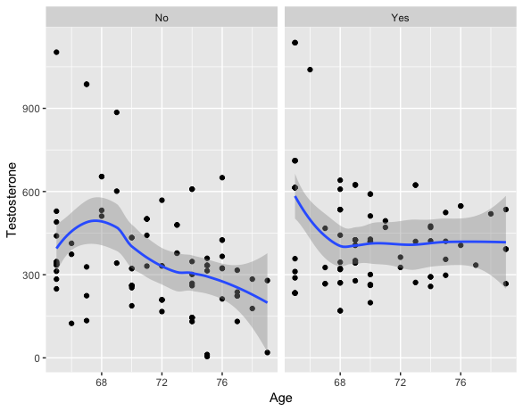
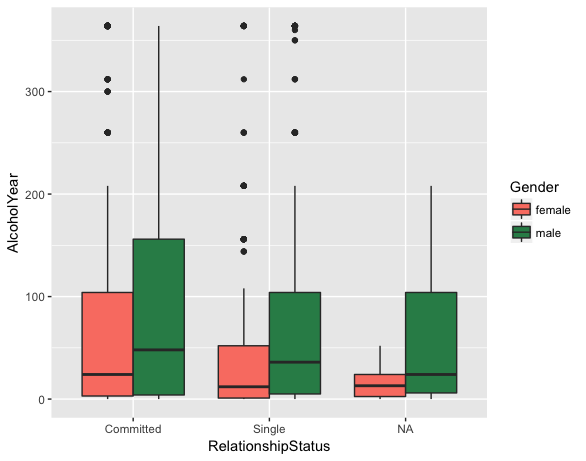
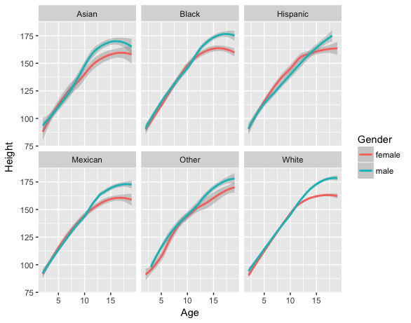

This session will cover fundamental concepts for creating effective data visualization and will introduce tools and techniques for visualizing large, high-dimensional data using R. We will review fundamental concepts for visually displaying quantitative information, such as using series of small multiples, avoiding "chart-junk," and maximizing the data-ink ratio. We will cover the grammar of graphics (geoms, aesthetics, stats, and faceting) using the ggplot2 package to create plots layer-by-layer. 

This lesson assumes a basic familiarity with R, data frames, and manipulating data with tidyr, dplyr and the pipe `%>%`.

In this session, we will use the following packages:
- tidyverse 
- or readr, dplyr, & ggplot2

```{r lib}
library(tidyverse)
```

### Download data and skeleton script from GitHub into project
Go to GitHub [repo](https://github.com/mariekekjones/BIMS-bootcamp) to get these materials

### NHANES data

The data we're going to work with comes from the National Health and Nutrition Examination Survey (NHANES) program at the CDC. You can read a lot more about NHANES on the [CDC's website](http://www.cdc.gov/nchs/nhanes/) or [Wikipedia](https://en.wikipedia.org/wiki/National_Health_and_Nutrition_Examination_Survey). 

NHANES is a research program designed to assess the health and nutritional status of adults and children in the United States. The survey is one of the only to combine both survey questions and physical examinations. It began in the 1960s and since 1999 examines a nationally representative sample of about 5,000 people each year. The NHANES interview includes demographic, socioeconomic, dietary, and health-related questions. The physical exam includes medical, dental, and physiological measurements, as well as several standard laboratory tests. NHANES is used to determine the prevalence of major diseases and risk factors for those diseases. NHANES data are also the basis for national standards for measurements like height, weight, and blood pressure. Data from this survey is used in epidemiology studies and health sciences research, which help develop public health policy, direct and design health programs and services, and expand the health knowledge for the Nation.

We are using a small slice of this data. We're only using a handful of variables from the 2011-2012 survey years on about 5,000 individuals. The CDC uses a [sampling strategy](http://www.cdc.gov/nchs/data/series/sr_02/sr02_162.pdf) to purposefully oversample certain subpopulations like racial minorities. Naive analysis of the original NHANES data can lead to mistaken conclusions because the percentages of people from each racial group in the data are different from general population. The 5,000 individuals here are resampled from the larger NHANES study population to undo these oversampling effects, so you can treat this as if it were a simple random sample from the American population.

Let's read in the data to an object called `nh` and take a look with `View`. Remember, we need to load both the dplyr and readr packages (or tidyverse) for efficiently reading in and displaying this data.

```{r readNH}

# Read in downloaded data using readr package
nh <- read_csv(file="nhanes.csv")

# Show the first few lines of the data and the dimensions
nh

# Optionally bring up data in a viewer window.
# View(nh)
```

This particular excerpt has 5000 observations of 32 variables

### dplyr review

For those of you who were here for the Intro session yesterday, this will be a review. For those of you new to the tidyverse, this is exciting stuff!

The dplyr package gives you a handful of useful **verbs** for managing data. On their own they don't do anything that base R can't do. Here are some of the _single-table_ verbs we'll cover briefly in this lesson (single-table meaning that they only work on a single table -- contrast that to _two-table_ verbs used for joining data together). They all take a `data.frame` or `tbl` as their input for the first argument, and they all return a `data.frame` or `tbl` as output.

Show how to access dplyr cheat sheet from `Help` menu

1. `filter()`: filters _rows_ of the data where some condition is true
1. `group_by()`: groups a data frame by one or more variable. Most data operations are useful done on groups defined by variables in the the dataset. The `group_by` function takes an existing data frame and converts it into a grouped data frame where `summarize()` operations are performed _by group_.
1. `summarize()`: summarizes multiple values to a single value, most useful when combined with `group_by()`

dplyr takes a tibble dataframe as its first argument and then a logical condition to meet as the second argument.

- `==`: Equal to
- `!=`: Not equal to
- `>`, `>=`: Greater than, greater than or equal to
- `<`, `<=`: Less than, less than or equal to

If you want to satisfy *all* of multiple conditions, you can use the "and" operator, `&`. The "or" operator `|` (the pipe character, usually shift-backslash) will return a subset that meet *any* of the conditions.

Let's use filter to return rows where the person was elderly (defined as >= 80 years old)

```{r children}
filter(nh, Age >= 80)
```

The dplyr package also imports functionality from the [magrittr](https://github.com/smbache/magrittr) package that lets you _pipe_ the output of one function to the input of another, so you can avoid nesting functions. It looks like this: **`%>%`**. You don't have to load the magrittr package to use it since it is part of dplyr too.

Here's the simplest way to use the pipe. Remember the `head()` function. It expects a data frame as input, and the next argument is the number of lines to print. These two commands are identical:

```{r headpipe}
head(nh, 5)
nh %>% head(5)
```

Now let's use the pipe operator with filter

```{r filterpipe}
filter(nh, Age >= 80) #without pipe
nh %>% filter(Age >= 80) #pipe!
```

### Nesting v. %>%

Let's say we want to see the mean height, grouped by Race, only for adults.

The way you do this without pipes is completely inside-out and backwards from the way you express in words and in thought what you want to do. Because the arguments belonging to a function get pushed farther and father away from the function name as you add more nesting elements, that results in messy, unreadable code. 
```{r wo pipe}
summarize(group_by(filter(nh, Age >= 18), Race), meanHeight=mean(Height, na.rm = TRUE))
```

Compare this code with the mental process of what you're actually trying to accomplish. 

Really what we want to do:
1. take nh THEN
1. filter for adults THEN
1. group_by Race THEN
1. summarize mean Height and remove NAs

The pipe operator `%>%` allows us to group the arguments with their function and order the functions in the same order as we want to do them. In this way we can pass the output tibble from one function to the input tibble of the next function.

```{r w pipe}
nh %>%
  filter(Age >= 18) %>%
  group_by(Race) %>%
  summarize(meanHeight = mean(Height, na.rm = TRUE))

#would be nice to see this list arranged in order
nh %>%
  filter(Age >= 18) %>%
  group_by(Race) %>%
  summarize(meanHeight = mean(Height, na.rm = TRUE)) %>%
  arrange(meanHeight)
```


#### ** EXERCISE 1 **
** YOUR TURN **
A. How many observations are there of children (< 18 years old)?
B. How many cases of obese children are there (BMI >= 30)?
C. Use `filter()`, `group_by()` and `summarize()` to find the mean BMI by Smoking Status for only Adults who have Diabetes. Do diabetic smokers or non-smokers have higher BMI?

```{r ex1}
#A
nh %>% 
  filter(Age < 18)

#B
nh %>% 
  filter(Age < 18 & BMI >= 30)

#C
nh %>%
  filter(Age >= 18 & Diabetes == "Yes") %>%
  group_by(SmokingStatus) %>%
  summarize(meanBMI = mean(BMI, na.rm = TRUE))
```

Alternatively to answer C, you could have grouped by both Smoking Status and Diabetes to answer this question
```{r}
nh %>%
  group_by(SmokingStatus, Diabetes) %>%
  summarize(meanBMI = mean(BMI, na.rm = TRUE))
```

Let's make some plots to examine the relationships between variables. We will be plotting using ggplot2

### About ggplot2

**ggplot2** is a widely used R package that extends R's visualization capabilities. It takes the hassle out of things like creating legends, mapping other variables to scales like color, or plotting multiple small plots together.

_Where does the "gg" in ggplot2 come from?_ The **ggplot2** package provides an R implementation of Leland Wilkinson's *Grammar of Graphics* (1999). The *Grammar of Graphics* allows you to think beyond the garden variety plot types (e.g. scatterplot, barplot) and the consider the components that make up a plot or graphic, such as how data are represented on the plot (as lines, points, etc.), how variables are mapped to coordinates or plotting shape or color, what transformation or statistical summary is required, and so on. 

Specifically, **ggplot2** allows you to build a plot layer-by-layer by specifying:

- a **geom**, which specifies how the data are represented on the plot (points, lines, bars, etc.),
- **aesthetics** that map variables in the data to axes on the plot or to plotting size, shape, color, etc.,
- **facets**, which we've already seen above, that allow the data to be divided into chunks on the basis of other categorical or continuous variables and the same plot drawn for each chunk.

_First, a note about `qplot()`._ The `qplot()` function is a quick and dirty way of making ggplot2 plots. You might see it if you look for help with ggplot2, and it's even covered extensively in the ggplot2 book. And if you're used to making plots with built-in base graphics, the `qplot()` function will probably feel more familiar. But the sooner you abandon the `qplot()` syntax the sooner you'll start to really understand ggplot2's approach to building up plots layer by layer. So we're not going to use it at all in this class.

See [R Graphics Cookbook](http://www.cookbook-r.com/Graphs/) for more help with ggplot2.

### Scatterplots
Age (X) against Height (Y) (continuous X, continuous Y)
```{r}
nh %>%
  ggplot(aes(x = Age, y = Height)) #what happened...why?

nh %>%
  ggplot(aes(x = Age, y = Height)) + geom_point()

#color the points by Gender
nh %>%
  ggplot(aes(x= Age, y = Height)) + 
  geom_point(aes(color = Gender))

#color the points blue and shape them as +
nh %>%
  ggplot(aes(x= Age, y = Height)) + 
  geom_point(color = "blue", shape = 3)

#what is the difference between coloring by a variable and coloring by static values
#color the points by Gender (again)
nh %>%
  ggplot(aes(x= Age, y = Height)) + 
  geom_point(aes(color = Gender))

#plot points colored by Gender and smoothed line
nh %>%
  ggplot(aes(x= Age, y = Height)) +
  geom_point(aes(color = Gender)) + 
  geom_smooth() #both genders
```

By default `geom_smooth()` will try to lowess (Locally Weighted Scatterplot Smoothing) for data with n<1000 or GAM (Generalized Additive models) for data with n>1000. (In the geom_smooth help menu you can read all about these)

`geom_smooth()` using method = 'gam' and formula 'y ~ s(x, bs = "cs")'. The s = smoothing function. bs = basis of smoothing and cs = cubic regression spines with shrinkage

We can change the geom_smooth() behavior by tweaking the parameters to color by Gender and use a LOESS instead of a GAM.
```{r}
#plot smoothed trend line and points both colored by gender
nh %>%
  ggplot(aes(x= Age, y = Height)) +
  geom_point(aes(color = Gender)) + 
  geom_smooth(aes(color = Gender), method = "loess")

# color all layers by Gender
nh %>%
  ggplot(aes(x= Age, y = Height, color = Gender)) +
  geom_point() + 
  geom_smooth(method = "loess")

# color all layers by Gender, add transparency to points, make line bolder
nh %>%
  ggplot(aes(x= Age, y = Height, color = Gender)) +
  geom_point(alpha = .2) + 
  geom_smooth(method = "loess", lwd = 2)
```

### ** EXERCISE 2 **
** YOUR TURN **
A. Use a scatterplot to investigate the relationship between Age and Testosterone.

B. Color the plot in A by Gender.

C. Create the plot in A for just men.

D. Filter for men > 65 and < 80 years old and then examine the relationship between Age and Testosterone.

E. Does the relationship you saw in D differ if the man is physically active (PhysActive == "Yes")? Use colored loess lines to see the effect of physical activity.
```{r}
#A
nh %>%
  ggplot(aes(x = Age, y = Testosterone)) + 
  geom_point()

#B
#color by Gender
nh %>%
  ggplot(aes(x = Age, y = Testosterone)) + 
  geom_point(aes(color = Gender))

#C
#just men
nh %>%
  filter(Gender == "male") %>%
  ggplot(aes(x = Age, y = Testosterone)) + 
  geom_point()

#D
nh %>%
  filter(Gender == "male" & Age > 65 & Age < 80) %>%
  ggplot(aes(x = Age, y = Testosterone)) + 
  geom_point()

#E
nh %>%
  filter(Gender == "male" & Age > 65 & Age < 80) %>%
  ggplot(aes(x = Age, y = Testosterone)) + 
  geom_point() + 
  geom_smooth(aes(color = PhysActive))
```

### Visualizations for discrete X

Above we were plotting a continuous X and a continuous Y. For visualizations with discrete X variables and continuous Y, boxplots will be shown instead of scatterplots.

Let's look at BMI by Smoking Status
```{r boxplot}
#blank canvas, note categories on X
nh %>%
  ggplot(aes(x = SmokingStatus, y = BMI))

# try with geom point
nh %>%
  ggplot(aes(x = SmokingStatus, y = BMI)) + geom_point()
# no variability in X values --> overplotting

# so add some random variability to x-axis using geom_jitter()
nh %>%
  ggplot(aes(x = SmokingStatus, y = BMI)) + geom_jitter()
```

Note that the little bit of horizontal noise that's added to the jitter is random. If you run that command over and over again, each time it will look slightly different. The idea is to visualize the density at each vertical position, and spreading out the points horizontally allows you to do that. If there were still lots of over-plotting you might think about adding some transparency by setting the `alpha=` value for the jitter.

```{r}
# remove NA category and add transparency
nh %>%
  filter(!is.na(SmokingStatus)) %>%
  ggplot(aes(x = SmokingStatus, y = BMI)) + 
  geom_jitter(alpha = .25)
```

Probably a more common visualization for a discrete X is to show a box plot:
```{r}
# categorical data can be plotted using boxplots
nh %>%
  filter(!is.na(SmokingStatus)) %>%
  ggplot(aes(x = SmokingStatus, y = BMI)) + 
  geom_boxplot()
```

Why not try visualizing both the underlying data (jitter) and the summary (boxplot)
```{r}
nh %>%
  filter(!is.na(SmokingStatus)) %>%
  ggplot(aes(x = SmokingStatus, y = BMI)) + 
  geom_jitter(alpha = .25) +
  geom_boxplot()
```

What can we do to improve the above plot?

```{r}
#need to make boxplot transparent and deal with fact that outliers will be plotted twice, once per layer
nh %>%
  filter(!is.na(SmokingStatus)) %>%
  ggplot(aes(x = SmokingStatus, y = BMI)) + 
  geom_jitter(alpha = .25) +
  geom_boxplot(alpha = .5, outlier.colour = NA)
```
If we want to see the effect of Gender on this relationship, remove jittered points and color boxplots by Gender

```{r}
nh %>%
  filter(!is.na(SmokingStatus)) %>%
  ggplot(aes(x = SmokingStatus, y = BMI)) + 
  geom_boxplot(aes(color = Gender))
```

That is not exactly what I wanted. I wanted to fill the whole box with color. Argument is fill instead of color
```{r}
nh %>%
  filter(!is.na(SmokingStatus)) %>%
  ggplot(aes(x = SmokingStatus, y = BMI)) + 
  geom_boxplot(aes(fill= Gender))
```

### **EXERCISE 3** 
** YOUR TURN **
A. Create boxplots showing height for Adults of different Races

B. Add jittered data under boxplots in A.

C. Color boxplots in A by Gender

```{r ex3}
#A.
nh %>%
  filter(Age > 18) %>%
  ggplot(aes(x = Race, y= Height)) +
  geom_boxplot()

#B. 
nh %>%
  filter(Age > 18) %>%
  ggplot(aes(x = Race, y= Height)) +
  geom_jitter(alpha = .25) +
  geom_boxplot(alpha = .7, outlier.colour = NA)

#C.
nh %>%
  filter(Age > 18) %>%
  ggplot(aes(x = Race, y= Height)) +
  geom_boxplot(aes(fill = Gender))
```

### Plotting univariate continuous data

What if we just wanted to visualize distribution of a single continuous variable? A histogram is the usual go-to visualization. Here we only have one aesthetic mapping instead of two.

```{r init_histogram}
nh %>%
  ggplot(aes(Height))

#save canvas as p then add histogram
p <- nh %>%
  ggplot(aes(Height))

p + geom_histogram()
```

Interesting shape because this includes children. When we do this ggplot lets us know that we're automatically selecting the width of the bins, and we might want to think about this a little further.

```{r}
p + geom_histogram(bins=30)
p + geom_histogram(bins=10)
p + geom_histogram(bins=200)
```

```{r histogram}
p + geom_histogram(bins=60)
```

Alternatively we could plot a smoothed density curve instead of a histogram:

```{r}
p + geom_density()
```

Back to histograms. What if we wanted to color this by Race?

```{r}
p + geom_histogram(aes(color=Race))
```

That's not what we had in mind. That's just the outline of the bars. We want to change the _fill_ color of the bars.

```{r}
p + geom_histogram(aes(fill=Race))
```

Well, that's not exactly what we want either. If you look at the help for `?geom_histogram` you'll see that by default it stacks overlapping points. This isn't really an effective visualization. Let's change the position argument.

```{r}
p + geom_histogram(aes(fill=Race), position="identity")
```

Now the problem is that the histograms are blocking each other. What if we tried transparency?

```{r}
p + geom_histogram(aes(fill=Race), position="identity", alpha=1/3)
```

That's somewhat helpful, and might work for two distributions, but it gets cumbersome with 5. Let's try this with density plots, first changing the color of the line:

```{r}
p + geom_density(aes(color=Race), lwd = 2)
```

Then by changing the color of the fill and setting the transparency to 25%:

```{r densityplot, eval=TRUE, fig.keep="last"}
p + geom_density(aes(color = Race, fill=Race), alpha=1/4)
```

### Faceting

Facets display subsets of the data in different panels. There are a couple ways to do this, but `facet_wrap()` tries to sensibly wrap a series of facets into a 2-dimensional grid of small multiples. Just give it a formula specifying which variables to facet by. If you have a look at the help for `?facet_wrap()` you'll see that we can control how the wrapping is laid out.

Remember how our histograms of height by Race were not easy to read when they were overlapping? Perhaps a good solution instead of transparency, is to facet.

```{r hist_facet1}
nh %>%
  ggplot(aes(Height)) +
  geom_histogram(aes(fill = Race), position = "identity")

#facet histograms by race
nh %>%
  ggplot(aes(Height)) +
  geom_histogram(aes(fill = Race), position = "identity") +
  facet_wrap(~Race)

#facet density plots by Race
nh %>%
  ggplot(aes(Height)) +
  geom_density() +
  facet_wrap(~Race)
```

### Choosing colors and themes

```{r}
# boxplot of BMI by Smoking status without missing Smoking Status
nh %>%
  filter(!is.na(SmokingStatus)) %>%
  ggplot(aes(x = SmokingStatus, y = BMI)) + 
  geom_boxplot()

#colored by Diabetes
nh %>%
  filter(!is.na(SmokingStatus)) %>%
  ggplot(aes(x = SmokingStatus, y = BMI)) + 
  geom_boxplot(aes(fill = Diabetes))

# colors()

#change colors manually
nh %>%
  filter(!is.na(SmokingStatus)) %>%
  ggplot(aes(x = SmokingStatus, y = BMI)) + 
  geom_boxplot(aes(fill = Diabetes)) +
  scale_fill_manual(values = c("cornflowerblue", "coral1"))

#change theme
nh %>%
  filter(!is.na(SmokingStatus)) %>%
  ggplot(aes(x = SmokingStatus, y = BMI)) + 
  geom_boxplot(aes(fill = Diabetes)) +
  scale_fill_manual(values = c("cornflowerblue", "coral1")) +
  theme_bw()
```

### ** EXERCISE 4 **
** YOUR TURN **
Practice creating the plots pictured below

A. 

<br>
No = not physically active, Yes = physically active

B. 

<br>
Custom colors are "salmon" and "seagreen"

C. 

<br>

```{r ex}
#A
nh %>%
  filter(Gender == "male" & Age >= 65 & Age < 80) %>%
  ggplot(aes(Age, Testosterone)) +
  geom_point() +
  facet_wrap(~PhysActive) +
  geom_smooth()

#B
nh %>%
  ggplot(aes(x = RelationshipStatus, y = AlcoholYear, fill = Gender)) +
  geom_boxplot() +
  scale_fill_manual(values = c("salmon", "seagreen"))

#C
nh %>%
  filter(Age < 20) %>%
  ggplot(aes(x = Age, y = Height)) +
  geom_smooth(aes(color = Gender)) +
  facet_wrap(~ Race)
```
